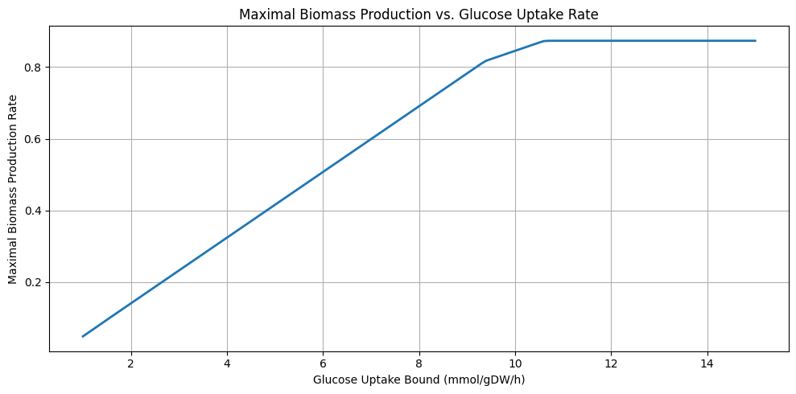

# Assignment: Metabolic Modeling (Week 2)

**Course**: KEN3170 — Multi-scale modeling of biological systems
**Group number**: 11

---

## 1. Repository overview

- `analysis_week2.ipynb` — main analysis notebook containing all required sections
- `KEN3170_Assignment_2026_e_coli_core_expression.csv` — maximal reaction activity data
- `README.md` — this file
- `requirements.txt` — Python dependencies (numpy, matplotlib, pandas, cobra, escher)

**How to run**:
1. Install dependencies: `pip install -r requirements.txt`
2. Open `analysis_week2.ipynb` and run all cells from top to bottom.

---

## 2. Part 1 — Reaction activity visualization

- 1a. Maximal reaction activities in linear pathways
The flux through the linear reaction are not exactly equal to each other. 
This can be explained by the fact that they represent the capacity of the reactions and not the flux itself. As they are not steady-state fluxes, they also are not required to be equal.

- 1b. Grey arrow values and their meaning
1b: Grey arrows are reactions that have no flux flowing through the reaction at the point of the visualization or that there is no data for these reactions

---

## 3. Part 2 — Enzyme activity-constrained metabolic model

Used maximal reaction activity values from e_coli_core_expression.csv in order to contrain the flux bounds of every reaction in the E.coli model. Witht he following rules:
    -Reactions with expression data: If reversible, constrained to -1000 and 1000; If irreversible, contrained to 0 and 1000
    -Reaction with no expression data: Left untouched
    -EX_glc__D_e (glucose exchange): Constrained to -1000 and 1000
    -ATPM: left untouched

Resulting lower and upper bounds for every reaction were printed as a table

| Reaction | Lower Bound | Upper Bound |
|---|---:|---:|
| PFK | 0.00 | 13.10 |
| PFL | 0.00 | 0.00 |
| PGI | -11.10 | 11.10 |
| PGK | -24.00 | 24.00 |
| PGL | 0.00 | 7.30 |
| ACALD | -0.00 | 0.00 |
| AKGt2r | -0.00 | 0.00 |
| PGM | -21.70 | 21.70 |
| PIt2r | -5.20 | 5.20 |
| ALCD2x | -0.00 | 0.00 |
| ACALDt | -1000.00 | 1000.00 |
| ACKr | -2.50 | 2.50 |
| PPC | 0.00 | 3.60 |
| ACONTa | -21.40 | 21.40 |
| ACONTb | -21.40 | 21.40 |
| ATPM | 8.39 | 1000.00 |
| PPCK | 0.00 | 13.30 |
| ACt2r | -3.60 | 3.60 |
| PPS | 0.00 | 3.10 |
| ADK1 | -27.40 | 27.40 |
| AKGDH | 0.00 | 26.70 |
| ATPS4r | -80.10 | 80.10 |
| PTAr | -4.47 | 4.47 |
| PYK | 0.00 | 28.20 |
| BIOMASS_Ecoli_core_w_GAM | 0.00 | 1000.00 |
| PYRt2 | -0.00 | 0.00 |
| CO2t | -1000.00 | 1000.00 |
| RPE | -6.30 | 6.30 |
| CS | 0.00 | 21.40 |
| RPI | -5.60 | 5.60 |
| SUCCt2_2 | 0.00 | 0.00 |
| CYTBD | 0.00 | 41.10 |
| D_LACt2 | -0.00 | 0.00 |
| ENO | -29.30 | 29.30 |
| SUCCt3 | 0.00 | 0.00 |
| ETOHt2r | -1000.00 | 1000.00 |
| SUCDi | 0.00 | 27.30 |
| SUCOAS | -19.40 | 19.40 |
| TALA | -4.50 | 4.50 |
| THD2 | 0.00 | 6.50 |
| TKT1 | -3.50 | 3.50 |
| TKT2 | -3.50 | 3.50 |
| TPI | -70.00 | 70.00 |
| EX_ac_e | 0.00 | 1000.00 |
| EX_acald_e | 0.00 | 1000.00 |
| EX_akg_e | 0.00 | 1000.00 |
| EX_co2_e | -1000.00 | 1000.00 |
| EX_etoh_e | 0.00 | 1000.00 |
| EX_for_e | 0.00 | 1000.00 |
| EX_fru_e | 0.00 | 1000.00 |
| EX_fum_e | 0.00 | 1000.00 |
| EX_glc__D_e | -1000.00 | 1000.00 |
| EX_gln__L_e | 0.00 | 1000.00 |
| EX_glu__L_e | 0.00 | 1000.00 |
| EX_h_e | -1000.00 | 1000.00 |
| EX_h2o_e | -1000.00 | 1000.00 |
| EX_lac__D_e | 0.00 | 1000.00 |
| EX_mal__L_e | 0.00 | 1000.00 |
| EX_nh4_e | -1000.00 | 1000.00 |
| EX_o2_e | -1000.00 | 1000.00 |
| EX_pi_e | -1000.00 | 1000.00 |
| EX_pyr_e | 0.00 | 1000.00 |
| EX_succ_e | 0.00 | 1000.00 |
| FBA | -30.40 | 30.40 |
| FBP | 0.00 | 1.20 |
| FORt2 | 0.00 | 1000.00 |
| FORt | -1000.00 | 0.00 |
| FRD7 | 0.00 | 15.60 |
| FRUpts2 | 0.00 | 3.00 |
| FUM | -24.40 | 24.40 |
| FUMt2_2 | 0.00 | 0.00 |
| G6PDH2r | -6.50 | 6.50 |
| GAPD | -24.50 | 24.50 |
| GLCpts | 0.00 | 21.10 |
| GLNS | 0.00 | 4.50 |
| GLNabc | 0.00 | 0.30 |
| GLUDy | -7.60 | 7.60 |
| GLUN | 0.00 | 5.40 |
| GLUSy | 0.00 | 7.30 |
| GLUt2r | -0.00 | 0.00 |
| GND | 0.00 | 5.60 |
| H2Ot | -1000.00 | 1000.00 |
| ICDHyr | -12.40 | 12.40 |
| ICL | 0.00 | 3.40 |
| LDH_D | -0.00 | 0.00 |
| MALS | 0.00 | 4.50 |
| MALt2_2 | 0.00 | 0.00 |
| MDH | -7.80 | 7.80 |
| ME1 | 0.00 | 3.30 |
| ME2 | 0.00 | 3.40 |
| NADH16 | 0.00 | 40.10 |
| NADTRHD | 0.00 | 1.30 |
| NH4t | -1000.00 | 1000.00 |
| O2t | -1000.00 | 1000.00 |
| PDH | 0.00 | 26.60 |

---

## 4. Part 3 — Biomass production optimization

- 3a. Maximal biomass production under expression-based constraints
    
    -The maximal biomass rate under expression-based constraints is 0.87 mmol/gDW/h.
- 3b. Glucose uptake bound of 5 mmol/gDW/h and its interpretation
    
    -The glucose uptake bound means in practice that the cell has a limit on how much energy the cell can use for biomass production. Without this limit the expression-based constraints show the limit of maximal production in a scenario with infinite glucose
- 3c. Biomass production rate with the additional glucose uptake constraints, comparison of rates and explanation
    
    -When limitng the amount of energy can use for biomass production optimization, the new maximal biomass production rate is 0.42 mmol/gDW/h. This is slightly less than half of the initial situation where there are only expression-based constraints.
---

## 5. Part 4 — Glucose uptake and growth rate analysis

- 4a. Plot of maximal biomass production vs. glucose uptake bound (1–15 mmol/gDW/h, increments of 0.1)

- 4b. 
    -We see that there is a clear positive relation between an increased bound for glucose uptake and the maximal biomass production rate. This holds true until a ceiling of supplied glucose of around 9.5 mmol/gDW/h where the marginal increase of maximal production declines.
    
     The maximal biomass production does not increase farther from around 10.4 mmol/gDW/h of supplied glucose 
     This maximal production rate matches the production rate found in task 3a with only expression-based constraints.

- 4c.
    -By comparing the activated processes in the model for segment 1 where the graph is increasing and segment 2 where the graph stops increasing with increased glucose, we found that the process  with ID "Ex_ac_e" gets activated. 
---

## 6. Conclusions
