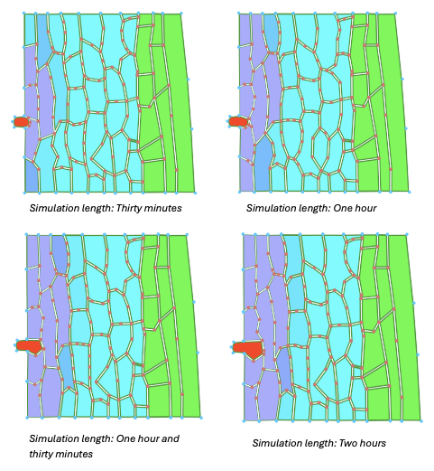

KEN3170 – Plant Tissue Simulations Assignment

# Task 1 - Pathogen Infection and Tissue Deformation

## Question

Open the `pathogen_infection` model and run the simulation for **2 hours**.  
Take screenshots of the initial state and subsequently at **30-minute intervals**. 
Describe how the i
nfected region spreads through the tissue and how the tissue deforms.

---

## Simulation Results

The figure below shows the progression of the simulation at 30-minute intervals.

[Open the original simulation figure (PDF)](images/four_figures.pdf)

---

## Observations and Interpretation

Over the two-hour simulation, the effect of the pathogen progressively spreads from the initial infection site into the surrounding plant tissue. Cells located closest to the pathogen are affected first, after which the affected region extends into neighbouring cells.

The **purple/blue color** is determined by the concentration of `Chemical(0)` inside the plant cells. In the practical sessions, `Chemical(0)` was used to represent **auxin**. However, in the `Infection.cpp` implementation, we could not find a specific mention. Therefore, it is more precise to interpret the colour here as the concentration of `Chemical(0)`.

As the simulation progresses, the concentration of `Chemical(0)` spreads through neighbouring cells. At the same time, the tissue becomes more and more deformed around the infection site. According to the model implementation, increasing levels of `Chemical(0)` reduce the **stiffness of the affected cell walls**. The weakened walls are therefore more susceptible to deformation, resulting in irregular cell shapes around the pathogen.

Another clear observation is the progressive growth of the **red pathogen**. The pathogen increases in size throughout the simulation and contributes to the local deformation of the surrounding tissue. As the cell walls weaken and the pathogen expands, it begins to push further into the plant tissue.

When the simulation is continued beyond the required two hours, the pathogen eventually becomes sufficiently large to **divide**. This behaviour is also implemented in the model: the pathogen continuously increases its target area and divides after reaching a specified size threshold. Over longer simulation times, repeated growth and division allow it to progressively occupy a larger region of the tissue.

### Progression Steps

**Pathogen growth**  
 - increased `Chemical(0)` in the surrounding tissue due to 
pathogen production of this chemical 
- diffusion to neighbouring cells  
- reduced cell-wall stiffness  
-  increased local tissue deformation  
- continued pathogen growth and eventual division

# Task Two - The CellHouseKeeping method

## Question

In the model files (`GitHub repo - Models - Infection - Infection.cpp`), read the `CellHouseKeeping` function. In your own words: how is a cell's wall stiffness reduced as a function of its chemical level? What does the pathogen do differently?

## Interpretation

The function `CellHouseKeeping` starts with an `if` condition that checks whether the cell type is `== 2`. After investigating the `SetCellColor` function, we found that `CellType == 2` represents the pathogenic fungus, which is always coloured red (line 73 of `Infection.cpp`).

If the condition is true, meaning that the cell is a pathogen, its target area is increased. Then, if its current area becomes larger than the threshold defined by `rel_cell_div_threshold * BaseArea`, the pathogen cell divides.

To reduce the wall stiffness, the `patho_chem_level` is first calculated as:

`patho_chem_level = Chemical(0) / 0.5`

The maximum value of `patho_chem_level` is capped at `1.2`. Wall weakening is only applied to cells that are **not pathogen cells** (`CellType != 2`) and have a `patho_chem_level > 0.1`.

When these conditions are satisfied, `SetCellVeto(false)` is applied and the wall stiffness is reduced according to:

`stiffness_inf = 3 - patho_chem_level`

The resulting stiffness value is then applied to all wall elements of the cell. Therefore, a higher `patho_chem_level` results in a lower wall stiffness.

If these conditions are not satisfied, the wall stiffness remains at its default value of `3`, and `SetCellVeto(true)` is applied.

